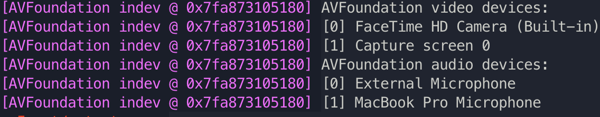

# 直播服务器的两种尝试(HLS/RTMP)

## 第一种HLS
首先需要在提供rtmp服务的服务器上进行如下操作
```bash
apt-get update
apt-get install gcc  # gcc 支持
apt-get install libnginx-mod-rtmp # 支持rtmp模块的nginx
```

然后需要配置nginx.conf
```bash
/etc/nginx/nginx.conf # ubuntu path
```
同时需要配置服务器防火墙ufw (允许port 1935 traffic)
```bash
sudo ufw allow 1935/tcp
```

具体配置可以参考
```apacheconf
user www-data;
worker_processes auto;
pid /run/nginx.pid;
include /etc/nginx/modules-enabled/*.conf;

events {
	worker_connections 768;
	# multi_accept on;
}


rtmp {                #RTMP服务
    server {
        listen 1935;  #//服务端口 
	    chunk_size 4096;   #//数据传输块的大小
        
        application vidz {
            play /etc/nginx/test/vids; #//视频文件存放位置。
			live on;
			record off;
        }

		# hls 推流 # hls 的实测延迟非常高
		application hls {
			live on;
			hls on;
			hls_path /etc/nginx/test/broadcast/hls;
		}
    }
}


http {

	##
	# Basic Settings
	##

	sendfile on;
	tcp_nopush on;
	types_hash_max_size 2048;
	# server_tokens off;

	# server_names_hash_bucket_size 64;
	# server_name_in_redirect off;

	include /etc/nginx/mime.types;
	default_type application/octet-stream;

	##
	# SSL Settings
	##

	ssl_protocols TLSv1 TLSv1.1 TLSv1.2 TLSv1.3; # Dropping SSLv3, ref: POODLE
	ssl_prefer_server_ciphers on;

	##
	# Logging Settings
	##

	access_log /var/log/nginx/access.log;
	error_log /var/log/nginx/error.log;

	##
	# Gzip Settings
	##

	gzip on;

	# gzip_vary on;
	# gzip_proxied any;
	# gzip_comp_level 6;
	# gzip_buffers 16 8k;
	# gzip_http_version 1.1;
	# gzip_types text/plain text/css application/json application/javascript text/xml application/xml application/xml+rss text/javascript;


	keepalive_timeout  65;
    server {
        listen       80;
        server_name  localhost;

        #charset koi8-r;

        #access_log  logs/host.access.log  main;

        location / {
            root   /etc/nginx/test;
            index  index.html index.htm;
            autoindex on;
            # autoindex_exact_size off;            
        }

        location /images {
            # root path 是拼接形式 也就是 path+location 后面的route path 才是真正的path
            # alias path 不需要拼接
            # alias /usr/local/var/ui; 
            root /etc/nginx/test/;
            # add_header  Cache-control "public";
            # access_log  off;
            # expires 90d;
            autoindex on;
            # autoindex_exact_size off;
        }

		# 拉流
		location /hls {
			types {
				application/vnd.apple.mpegurl m3u8;
				video/mp2t ts;
			}

			alias /etc/nginx/test/broadcast/hls;
			
			add_header Cache-Control no-cache;
		}


        error_page   500 502 503 504  /50x.html;
        location = /50x.html {
            root   /etc/nginx/test/;
        }
    }


	##
	# Virtual Host Configs
	##

	include /etc/nginx/conf.d/*.conf;
	# include /etc/nginx/sites-enabled/*;
}


#mail {
#	# See sample authentication script at:
#	# http://wiki.nginx.org/ImapAuthenticateWithApachePhpScript
#
#	# auth_http localhost/auth.php;
#	# pop3_capabilities "TOP" "USER";
#	# imap_capabilities "IMAP4rev1" "UIDPLUS";
#
#	server {
#		listen     localhost:110;
#		protocol   pop3;
#		proxy      on;
#	}
#
#	server {
#		listen     localhost:143;
#		protocol   imap;
#		proxy      on;
#	}
#}

```

注意这里使用了一个地址中的素材
```bash
/etc/nginx/test/*
```
需要更改权限使得所有者可以读写
```bash
chmod -R 755 /etc/nginx/test
```
配置完成后可以启动nginx服务
```bash
systemctl start nginx 
# 或者 nginx -t -c /etc/nginx/nginx.conf 
```

这个时候可以启动本地的录制工具录制m3u8格式的流媒体视频，使用推流接口推送到服务器上。提供一种实现(ffmpeg@MACOS)
```bash
ffmpeg -f avfoundation -pix_fmt uyvy422 -r 30 -i "0:0"  -c:v h264 -c:a aac -preset ultrafast -tune zerolatency -s 1280x720 -f flv rtmp://public_ip_of_rtmp_server:1935/hls/live # 注意填写rtmp服务器ip
```
* 说明部分ffmpeg参数
1. -f:何种格式的视频(可用于输入/输出) avfoundation 为macos原生支持的硬件输入格式
flv 表示希望的输出为flv格式
2. -pix_fmt: pixel format 支持的像素格式建议在mac下使用uyvy422
3. -r: 帧率 (作者的设备最高前置摄像头支持30fps)
4. -i: 标记输入设备 "v:a" v表示video视频输入, a表示audio音频输入 (a,v数字表示可以使用的设备编号)
5. -c: 表示codec编码格式 -c:v 表示video (原生摄像头建议h264), -c:a 表示audio (macos建议使用aac)
6. -preset/-tune: 部分同步预设
7. -s: 录像的屏幕大小 (作者的设备最高支持1280x720)
8. 最后为rtmp服务器的位置也就是nginx中设置的推流位置, 最后的live可以随便写, 但最后会生成对应的m3u8文件

此时已经开始直播可以观察到在下面的地址中出现新文件live.m3u8
```bash
/etc/nginx/test/broadcast/hls
```
一旦推流结束, 那么所有ts包括live.m3u8都会被自动删除

关于macbookpro本身支持的设备可以这样查看
```bash
ffmpeg -f avfoundation -list_devices true -i ""
```

如图上面[]中的数字代表设备编号, 可以用与上面的ffmpeg指令

在直播途中，可以使用其他支持播放流媒体的播放器观看比如使用ffmpeg或者vlc network streaming (html video tag 需要 videojs支持)。下面展示使用ffmpeg观看
```bash
ffplay "http://public_ip_of_rtmp_server/hls/live.m3u8" # 同样要替换成rtmp服务器ip, live对应前面推流最后给出的文件名字
```
还有一种方式是使用[hls.js](https://github.com/video-dev/hls.js/)实现网页播放, 可以使用下面的代码
```html
<script src="https://cdn.jsdelivr.net/npm/hls.js@1"></script>
<!-- Or if you want the latest version from the main branch -->
<!-- <script src="https://cdn.jsdelivr.net/npm/hls.js@canary"></script> -->
<video id="video" controls preload="auto" width="1280" height="720"></video>
<script>
  var video = document.getElementById('video');
  var videoSrc = 'http://public_ip_of_rtmp_server/hls/live.m3u8'; // 这里同样替换成远程rtmp服务器的ip
  if (Hls.isSupported()) {
    var hls = new Hls();
    hls.loadSource(videoSrc);
    hls.attachMedia(video);
  }
  // HLS.js is not supported on platforms that do not have Media Source
  // Extensions (MSE) enabled.
  //
  // When the browser has built-in HLS support (check using `canPlayType`),
  // we can provide an HLS manifest (i.e. .m3u8 URL) directly to the video
  // element through the `src` property. This is using the built-in support
  // of the plain video element, without using HLS.js.
  //
  // Note: it would be more normal to wait on the 'canplay' event below however
  // on Safari (where you are most likely to find built-in HLS support) the
  // video.src URL must be on the user-driven white-list before a 'canplay'
  // event will be emitted; the last video event that can be reliably
  // listened-for when the URL is not on the white-list is 'loadedmetadata'.
  else if (video.canPlayType('application/vnd.apple.mpegurl')) {
    video.src = videoSrc;
  }
</script>
```


这种使用hls插件的问题主要在于延迟很高通常会有20+s的延迟, 效果很不
理想。

---

## 第二种RTMP


---
主要参考的文档是 [hls搭建直播系统](https://blog.51cto.com/u_15024210/3016794), [rtmp直播系统](https://blog.csdn.net/kingroc/article/details/50839994), [rtmp-en](https://www.stackovercloud.com/2022/01/07/how-to-set-up-a-video-streaming-server-using-nginx-rtmp-on-ubuntu-20-04/)
