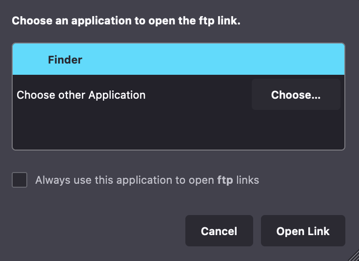
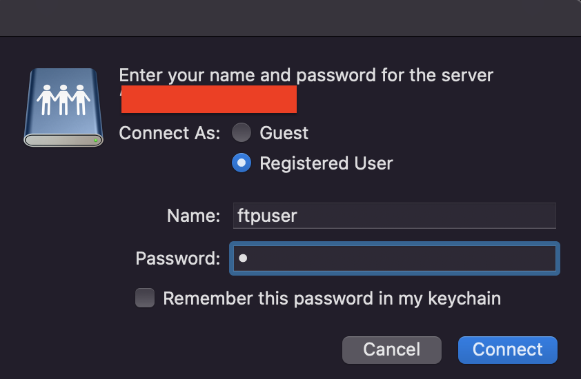
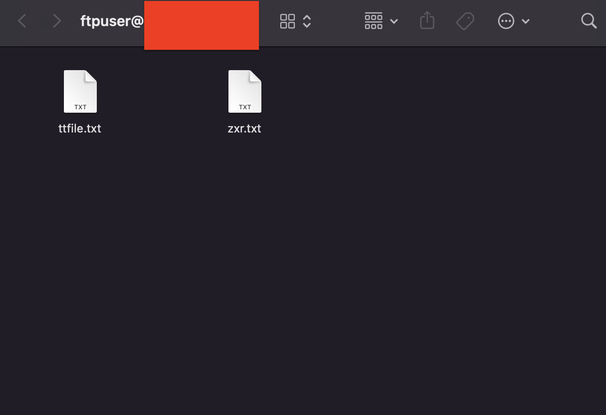
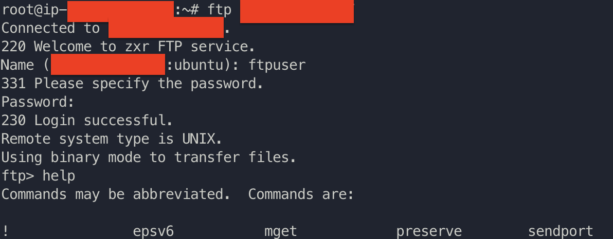

# 尝试使用Ubuntu 22.04 LTS搭建vsftp服务器

## 具体操作
首先安装vsftp
```bash
apt-get install vsfptd
```
对于aws ec2 ubuntu 可能需要安装nestat套件
```bash
apt install net-tools
```
成功后service vsftpd 应该会自动启动可以用netstat查看状态
```bash
sudo netstat -a | grep ftp
```

说明一切正常正在监听, 正常情况下此时ubuntu会自动更新20(数据)和21(指令)端口的ufw规则。这些是ftp默认的端口号, 如果没有可以手动设置。<br>
建议优先设置aws自身的security group in/out 规则, 默认下aws outbound allow all traffics。所以只需要添加两个custom tcp 20-21 就行。如果设置了不放心可以手动在ubuntu内部运行下面的代码
```bash
sudo ufw allow 20:21/tcp
```
tcp 说明指定是tcp否允则同时允许tcp和udp
接着需要修改vsftpd.conf, 具体说明看注释
```apacheconf
# Example config file /etc/vsftpd.conf
#
# The default compiled in settings are fairly paranoid. This sample file
# loosens things up a bit, to make the ftp daemon more usable.
# Please see vsftpd.conf.5 for all compiled in defaults.
#
# READ THIS: This example file is NOT an exhaustive list of vsftpd options.
# Please read the vsftpd.conf.5 manual page to get a full idea of vsftpd's
# capabilities.
#
#
# Run standalone?  vsftpd can run either from an inetd or as a standalone
# daemon started from an initscript.
listen=YES
#
# This directive enables listening on IPv6 sockets. By default, listening
# on the IPv6 "any" address (::) will accept connections from both IPv6
# and IPv4 clients. It is not necessary to listen on *both* IPv4 and IPv6
# sockets. If you want that (perhaps because you want to listen on specific
# addresses) then you must run two copies of vsftpd with two configuration
# files.
# 这里必须设置成NO否则会引发冲突导致服务不可用
listen_ipv6=NO
#
# Allow anonymous FTP? (Disabled by default).
anonymous_enable=NO
#
# Uncomment this to allow local users to log in.
local_enable=YES
#
# Uncomment this to enable any form of FTP write command.
write_enable=YES
#
# Default umask for local users is 077. You may wish to change this to 022,
# if your users expect that (022 is used by most other ftpd's)
# unix 权限掩码777-022=755正常mkdir的权限
local_umask=022
#
# Uncomment this to allow the anonymous FTP user to upload files. This only
# has an effect if the above global write enable is activated. Also, you will
# obviously need to create a directory writable by the FTP user.
#anon_upload_enable=YES
#
# Uncomment this if you want the anonymous FTP user to be able to create
# new directories.
#anon_mkdir_write_enable=YES
#
# Activate directory messages - messages given to remote users when they
# go into a certain directory.
dirmessage_enable=YES
#
# If enabled, vsftpd will display directory listings with the time
# in  your  local  time  zone.  The default is to display GMT. The
# times returned by the MDTM FTP command are also affected by this
# option.
# use_localtime=YES
#
# Activate logging of uploads/downloads.
xferlog_enable=YES
#
# Make sure PORT transfer connections originate from port 20 (ftp-data).
connect_from_port_20=YES
#
# If you want, you can arrange for uploaded anonymous files to be owned by
# a different user. Note! Using "root" for uploaded files is not
# recommended!
#chown_uploads=YES
#chown_username=whoever
#
# You may override where the log file goes if you like. The default is shown
# below.
#xferlog_file=/var/log/vsftpd.log
#
# If you want, you can have your log file in standard ftpd xferlog format.
# Note that the default log file location is /var/log/xferlog in this case.
xferlog_std_format=YES
#
# You may change the default value for timing out an idle session.
#idle_session_timeout=600
#
# You may change the default value for timing out a data connection.
#data_connection_timeout=120
#
# It is recommended that you define on your system a unique user which the
# ftp server can use as a totally isolated and unprivileged user.
#nopriv_user=ftpsecure
#
# Enable this and the server will recognise asynchronous ABOR requests. Not
# recommended for security (the code is non-trivial). Not enabling it,
# however, may confuse older FTP clients.
#async_abor_enable=YES
#
# By default the server will pretend to allow ASCII mode but in fact ignore
# the request. Turn on the below options to have the server actually do ASCII
# mangling on files when in ASCII mode.
# Beware that on some FTP servers, ASCII support allows a denial of service
# attack (DoS) via the command "SIZE /big/file" in ASCII mode. vsftpd
# predicted this attack and has always been safe, reporting the size of the
# raw file.
# ASCII mangling is a horrible feature of the protocol.
#ascii_upload_enable=YES
#ascii_download_enable=YES
#
# You may fully customise the login banner string:

# 这个主要用来在支持ftp服务的命令行使用ftp public_ip_addr_of_ftp_server 这个指令的时候在
# 最开始的欢迎部分出现
ftpd_banner=Welcome to zxr FTP service.

local_root=/ftpfile
anon_root=/ftpfile
use_localtime=YES

#
# You may specify a file of disallowed anonymous e-mail addresses. Apparently
# useful for combatting certain DoS attacks.
#deny_email_enable=YES
# (default follows)
#banned_email_file=/etc/vsftpd.banned_emails
#
# You may restrict local users to their home directories.  See the FAQ for
# the possible risks in this before using chroot_local_user or
# chroot_list_enable below.
#chroot_local_user=YES
#
# You may specify an explicit list of local users to chroot() to their home
# directory. If chroot_local_user is YES, then this list becomes a list of
# users to NOT chroot().
# (Warning! chroot'ing can be very dangerous. If using chroot, make sure that
# the user does not have write access to the top level directory within the
# chroot)

# 这下面圈起来的配置也是可有可无，主要限制限定的用户(这里是ftpuser这个用户能看到的root路径)。
# 防止出现命令行ftp可以操作上层(unix服务器根目录里的内容)有一定可能不希望userlist中用户能够
# 操作，上级目录。在本例中是无所谓的，因为上级是根目录所以不可能有权限可以删改。 最好还是设置上
# 防止出现问题
# ==========================================================
chroot_local_user=NO
chroot_list_enable=YES

# (default follows)
# 用来设置哪些用户需要放入chroot jail之中
chroot_list_file=/etc/vsftpd.chroot_list

allow_writeable_chroot=YES
# ==========================================================


#
# You may activate the "-R" option to the builtin ls. This is disabled by
# default to avoid remote users being able to cause excessive I/O on large
# sites. However, some broken FTP clients such as "ncftp" and "mirror" assume
# the presence of the "-R" option, so there is a strong case for enabling it.
#ls_recurse_enable=YES
#
# Customization
#
# Some of vsftpd's settings don't fit the filesystem layout by
# default.
#
# This option should be the name of a directory which is empty.  Also, the
# directory should not be writable by the ftp user. This directory is used
# as a secure chroot() jail at times vsftpd does not require filesystem
# access.
# secure_chroot_dir=/var/run/vsftpd/empty
#
# This string is the name of the PAM service vsftpd will use.
pam_service_name=ftp # 注意这里必须是ftp不能是其他教程说的vsftp
#
# This option specifies the location of the RSA certificate to use for SSL
# encrypted connections.
# 以下是可选的在这次的配置中可有可无
# ==========================================================
rsa_cert_file=/etc/ssl/certs/ssl-cert-snakeoil.pem
rsa_private_key_file=/etc/ssl/private/ssl-cert-snakeoil.key
ssl_enable=NO
# ==========================================================

#
# Uncomment this to indicate that vsftpd use a utf8 filesystem.
#utf8_filesystem=YES

# 限制只允许/etc/vsftpd.user_list中的用户访问ftp
userlist_enable=YES
userlist_deny=NO
pasv_enable=YES
# 这个随便配，给定一个pasv模式开放的随机端口范围方便客户端连接传送数据
pasv_min_port=61001
pasv_max_port=62000
# port_enable=YES

# 在ubuntu中被动模式下需要告诉客户机本服务器的public ip
pasv_address=[public_ip_addr_of_ftp_server] # 这里填写的是ftp服务器的公网ip用来告诉客户端需要访问的地址是什么
# pasv_addr_resolve=YES
```
注意上面的配置里面写到需要开放61001-62000端口, 和上面20-21端口一样配置。<br>
同时注意到配置中还需要我们添加两个新文件分别是
```bash
/etc/vsftpd.chroot_list
```
和
```bash
/etc/vsftpd.user_list
```
在本项目中都是一行plain txt 也就是唯一ftp授权用户ftpuser。


关于更多配置可以参考手册, 运行下面代码即可
```bash
man 5 /etc/vsfptd.conf
```

接下来, 我们需要建立上面提到的这个唯一用户ftpuser。这个用户对于bash命令行来说是匿名的。使用下面代码创建用户, 并创建这个用户可操作的一个文件夹(用来作为ftp服务器的文件仓库位置/ftpfile)
```bash
mkdir /ftpfile
```
```bash
useradd ftpuser -d /ftpfile/ -s /sbin/nologin #ftpuser没权限登陆机器, 并且默认的root地址是/ftpfile (也就是ftp登陆后的根目录)
```
上面useradd没有使用-g tag 所以默认是一个新的用户组, 也就是和ftpuser同名的用户组。我们需要修改/ftpfile的权限使得ftpuser可以读写这个文件夹里面的所有内容。
```bash
chown -R ftpuser.ftpuser /ftpfile
```
接着可以设置一下ftpuser的登陆密码
```bash
sudo passwd ftpuser
```
这个密码一会用于登陆ftp 服务器
可以在/ftpfile里面添加一些text文件作为测试, 一会登陆后可以看到。

此时可以restart vsfptd服务
```bash
service vsftpd restart
```
接下来演示两种方式测试这个ftp server的效果。

1. 使用macbook自带的finder通过read-only方式查看服务器中的文件
    - 首先在浏览器(Safari不支持)中打开
    ```bash
    ftp://public_ip_addr_of_ftp_server # 填写服务器ip
    ```
    - 然后选择使用finder打开
    
    - 输入用户名和密码
    
    - 显示服务器中的文件
    

2. 使用vsftp客户端
    - 在一台装了vsftp的linux机器上直接输入
    ```bash
    ftp public_ip_addr_of_ftp_server # 填写服务器ip
    ```
    - 同样按要求填写用户名密码
    
    - 进入操作界面输入help获取提示
    - put/get/delete/ 上传/下载/删除


---
主要参考的文档是 [ftp_en](https://sdykman.com/content/installing-vsftpd-ubuntu-1404-amazon-ec2-instance), [安装&配置vsftp](https://blog.csdn.net/qq_36938617/article/details/89077845), [vsftp config problem with ubuntu12.04+](https://askubuntu.com/questions/413677/vsftpd-530-login-incorrect)